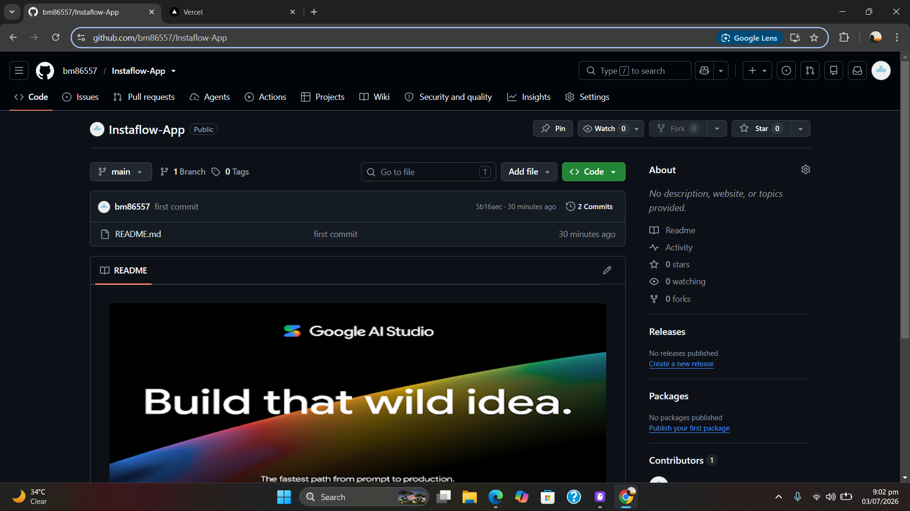

# 🔄 Server Refactoring Migration Guide

## What Changed?

Your `server.ts` file has been refactored into a modular structure for better maintainability and organization.

## New File Structure

```
server/
├── config/
│   └── firebase.ts              # Firebase Admin initialization
├── middleware/
│   └── auth.ts                  # Authentication middleware
├── services/
│   ├── userService.ts           # User database operations
│   ├── automationService.ts     # Automation rules logic
│   ├── instagramService.ts      # Instagram API calls
│   └── webhookService.ts        # Webhook processing (NEW - AUTO-REPLY ENGINE)
├── routes/
│   ├── auth.routes.ts           # Auth endpoints
│   ├── user.routes.ts           # User endpoints
│   ├── analytics.routes.ts      # Analytics endpoints
│   ├── automation.routes.ts     # Automation rules endpoints
│   └── webhook.routes.ts        # Webhook endpoints (NEW)
└── server.new.ts                # New main server file
```

## 🚀 How to Migrate

### Option 1: Backup and Replace (Recommended)

1. **Backup your old server:**
   ```bash
   mv server.ts server.old.ts
   ```

2. **Rename the new server:**
   ```bash
   mv server.new.ts server.ts
   ```

3. **Restart your server:**
   ```bash
   npm run dev
   ```

### Option 2: Manual Comparison

1. Keep both files and compare them
2. Test the new modular structure first
3. Once confirmed working, replace the old file

## ✅ What's Included

### **Existing Features (Refactored)**
- ✅ Firebase initialization
- ✅ Authentication middleware
- ✅ Instagram OAuth flow
- ✅ User management
- ✅ Analytics endpoints (followers, engagement, reach)
- ✅ Automation rules CRUD operations

### **New Features (Added)**
- ✅ **Webhook verification endpoint** - For Facebook to verify your server
- ✅ **Webhook receiver endpoint** - Receives real-time Instagram comment notifications
- ✅ **Comment processing logic** - Matches comments against automation rules
- ✅ **Auto-reply sender** - Sends replies via Instagram API
- ✅ **Reply history logging** - Tracks all auto-replies in Firestore
- ✅ **Statistics tracking** - Updates rule stats and user auto-reply counts

## 🔧 Testing the New Structure

### 1. Test Server Starts Successfully
```bash
npm run dev
```

You should see:
```
✅ Firebase Admin initialized
🚀 Server running on http://localhost:3000
📡 Webhook endpoint: http://localhost:3000/api/webhooks/instagram
✅ All routes loaded successfully
```

### 2. Test Existing Features Work
- Login to your app
- Check dashboard loads
- Create an automation rule
- Verify rule saves to Firestore

### 3. Test Webhook Endpoint
Visit in browser:
```
http://localhost:3000/api/webhooks/instagram?hub.mode=subscribe&hub.verify_token=instaflow_webhook_token_123&hub.challenge=test123
```

You should see: `test123` (the challenge returned)

## 📋 Next Steps to Enable Auto-Replies

### Step 1: Deploy to HTTPS Server
Webhooks only work with HTTPS. Options:
- Deploy to production server
- Use ngrok for testing: `ngrok http 3000`

### Step 2: Configure Facebook Webhook
1. Go to Meta Developer Dashboard
2. Navigate to Webhooks → Instagram
3. Add callback URL: `https://yourdomain.com/api/webhooks/instagram`
4. Verify token: `instaflow_webhook_token_123`
5. Subscribe to `comments` field

### Step 3: Test Auto-Reply
1. Create a rule with keyword "test"
2. Post a comment on your Instagram: "This is a test"
3. Check server logs for auto-reply processing
4. Verify reply appears on Instagram

## 🐛 Troubleshooting

### Error: "Cannot find module './server/config/firebase.js'"
**Solution:** Make sure all files are in the correct directories. The `server/` folder should be at the same level as `server.ts`.

### Error: "Module not found" during imports
**Solution:** Your `package.json` should have `"type": "module"` set. Check your tsconfig.json has proper module resolution.

### Webhook verification fails
**Solution:** 
- Check `WEBHOOK_VERIFY_TOKEN` in `.env` matches what you configured in Facebook
- Ensure the endpoint is publicly accessible (HTTPS)

### Auto-replies not working
**Solution:**
1. Check webhook is properly configured in Facebook
2. Verify `instagram_manage_comments` permission is granted
3. Check server logs for errors
4. Ensure rule is enabled and keyword matches

## 📊 Benefits of New Structure

### Better Organization
- Each feature has its own file
- Easy to find and modify specific functionality
- Clear separation of concerns

### Easier Maintenance
- Smaller, focused files
- Functions are reusable across routes
- Easier to test individual components

### Scalability
- Easy to add new routes
- Services can be imported anywhere
- Middleware can be applied selectively

## 🔄 Rollback Plan

If something goes wrong:

1. **Stop the server**
2. **Restore old server:**
   ```bash
   mv server.old.ts server.ts
   ```
3. **Restart:**
   ```bash
   npm run dev
   ```

## 📝 Notes

- Old `server.ts` is renamed to `server.old.ts` (keep as backup)
- New `server.ts` imports all modular files
- All endpoints remain at the same URLs
- No frontend changes needed
- Database structure unchanged

## ✨ New Capabilities

With the refactored structure, you can now:

1. **Receive Instagram comment notifications in real-time**
2. **Automatically match comments against your rules**
3. **Send replies via Instagram API**
4. **Track reply history in Firestore**
5. **Monitor automation statistics**

All of this happens automatically once you:
- Deploy to HTTPS
- Configure Facebook webhook
- Create automation rules

## 🎯 What Works Now

| Feature | Status |
|---------|--------|
| User authentication | ✅ Working |
| Instagram connection | ✅ Working |
| Dashboard analytics | ✅ Working |
| Create automation rules | ✅ Working |
| Save rules to database | ✅ Working |
| **Webhook receiver** | ✅ **NEW - Ready** |
| **Auto-reply engine** | ✅ **NEW - Ready** |
| **Reply logging** | ✅ **NEW - Ready** |

## 🚀 Ready to Go Live?

Once you complete the setup:
1. ✅ Backup old server
2. ✅ Replace with new modular structure
3. ✅ Test locally
4. ✅ Deploy to HTTPS server
5. ✅ Configure Facebook webhook
6. ✅ Test with real Instagram comments

Your automation is now **fully functional**! 🎉
